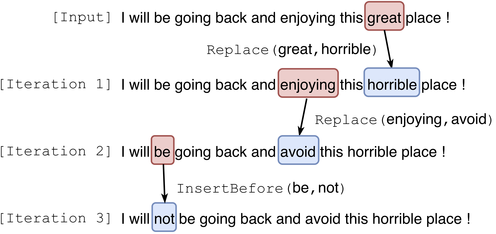
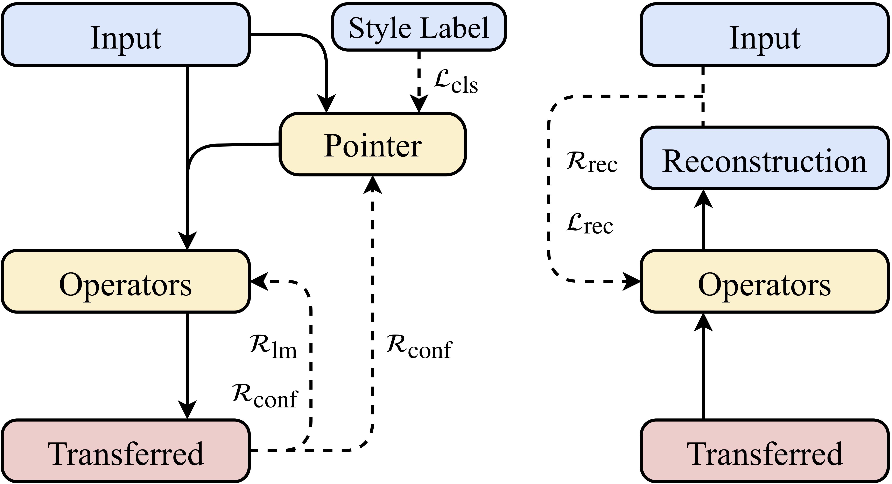

# Point-Then-Operate
This repository contains PyTorch implementations of the ACL2019 paper "A Hierarchical Reinforced Sequence Operation Method for Unsupervised Text Style Transfer". [[paper]](https://www.aclweb.org/anthology/P19-1482) | [[slides]](static/ACL_2019_PTO_Slides.pdf)

<p align="center">
     &nbsp;&nbsp;&nbsp;&nbsp;&nbsp;
    
</p> 

## Overview
* `data/yelp/` and `data/amazon/` are placeholder directories for the Yelp and the Amazon datasets, respectively
* `PTO-yelp/` and `PTO-amazon/` contain implementations of the proposed method for the Yelp and the Amazon datasets, respectively
* In the following lines, `{}` denotes *or*, e.g., `{yelp, amazon}` denotes `yelp` *or* `amazon`
* All commands should be run in `PTO-{yelp, amazon}/`, instead of the root directory
* `PTO-{yelp, amazon}/Experiment.py` builds the experiment pipeline, which has undergone incremental modifications and currently includes abstract (e.g., with heavy use of `getattr()` and `setattr()`) lines of codes. Thus, it is not recommended to heavily rely on the pipeline for your own projects

## Dependencies
* Python 3.6.5
* Versions of all depending libraries are specified in `requirements.txt`. To reproduce the reported results, please make sure that the specified versions are installed. **Update 28/08/2019**: We receive a security vulnerability alert for the specified version of `nltk` from GitHub.
* System outputs are evaluated based on the Moses BLEU script [multi-bleu.perl](https://github.com/moses-smt/mosesdecoder/blob/master/scripts/generic/multi-bleu.perl). Download the script and put it into `PTO-{yelp, amazon}/utils/`
* Run on a single NVIDIA GeForce GTX 1080 Ti
* CUDA 10.0

## Usage
### Test with Pre-Trained Models
* Download preliminary files from [Yelp preliminaries](https://drive.google.com/open?id=1N3-TvOvuG79LD6wrAnSB_645GDXZ_Mn1) and [Amazon preliminaries](https://drive.google.com/open?id=1ODbQT3c85dhOygsGSUjXH-_Uw3fn1g2r), which include
    - Pre-trained language models: `{yelp, amazon}_{0, 1}_{forward, backward}.pt`. Place them in `PTO-{yelp, amazon}/LM/saved_models/`
    - Pre-trained TextCNN: `best-TextCNN-{yelp, amazon}-Emb.ckpt` and  `best-TextCNN-{yelp, amazon}.ckpt`. Place them in `PTO-{yelp, amazon}/utils/`
    - Vocabulary: `{yelp, amazon}.vocab`. Place them in `data/{yelp, amazon}/`
* Download the pre-processed datasets from [Yelp dataset](https://github.com/lijuncen/Sentiment-and-Style-Transfer/tree/master/data/yelp) and [Amazon dataset](https://github.com/lijuncen/Sentiment-and-Style-Transfer/tree/master/data/amazon), which include
    - Non-aligned text files for both styles: `sentiment.{train, dev, test}.{0, 1}`. Place them in `data/{yelp, amazon}/`
    - Human written references for the test split: `reference.{0, 1}`. Place them in `data/{yelp, amazon}/`
* Download pre-trained models from [Yelp pre-trained](https://drive.google.com/open?id=1Po31UZEnKLaYt5JP3fLzNr5JZWKwLLmK) and [Amazon pre-trained](https://drive.google.com/open?id=197JPnfLUN-C9AzntmUrR_zUvcjvO8ArJ), which include
    - Pointer, operators, and the additional classifier: ten `.ckpt` files in total. Place them in `PTO-{yelp, amazon}/pretrained/`
* Run `python3 test.py` in `PTO-{yelp, amazon}/`
* Evaluation results, i.e., classification accuracy and BLEU score, are printed on the screen, which should be exactly the same as those reported in the paper.
* System outputs are saved under `PTO-{yelp, amazon}/outputs/sampled_results/`, which include
    - Negative to positive outputs: `sentiment.test.0.ours`
    - Positive to negative outputs: `sentiment.test.1.ours`
* Reminder: `reference.{0, 1}` aligns each test sample to its human reference. However, for the Amazon dataset, the order of sentences in `reference.{0, 1}` is not consistent with that in `sentiment.test.{0, 1}`. We fix it in `PTO-amazon/dataloaders/amazon.py`. Take care if you are using the Amazon dataset for your own project

### Train the Models
* Train language models (optional and *not* recommended since they are only used as extrinsic rewards)
    - Set the flags `self.sentiment` and `self.direction` in `PTO-{yelp, amazon}/LM/lm_config.py`
    - Run `python3 language_model.py` in `PTO-{yelp, amazon}/`
    - Repeat the previous two steps for each combination of `self.sentiment` and `self.direction`
* Train TextCNN (optional and *strongly not* recommended since TextCNN is used for *evaluation*)
    - Run `python3 classifier.py` in `PTO-{yelp, amazon}/`
* Train the additional classifier (optional and *not* recommended since they are used only for inference)
    - Set the flag `self.train_mode` in `PTO-{yelp, amazon}/config.py` as `aux-cls-only`
    - Run `python3 train.py` in `PTO-{yelp, amazon}/`
* Pre-train the pointer (obligatory since it is a necessary preparation for the following HRL training)
    - Set the flag `self.train_mode` in `PTO-{yelp, amazon}/config.py` as `cls-only`
    - Run `python3 train.py` in `PTO-{yelp, amazon}/`
* Jointly train the pointer and the operators with hierarchical reinforcement learning (HRL)
    - Move the pre-trained pointer and the additional classifier, along with their embeddings, from `PTO-{yelp, amazon}/outputs/saved_models` to `PTO-{yelp, amazon}/pretrained/` and modify their prefixes from `best-` to `pretrained-`
    - Set the flag `self.train_mode` in `PTO-{yelp, amazon}/config.py` as `pto`
    - Run `python3 train.py` in `PTO-{yelp, amazon}/`

## Citation
Please cite our ACL paper if this repository inspired your work.
```
@inproceedings{WuRLS19,
  author    = {Chen Wu and
               Xuancheng Ren and
               Fuli Luo and
               Xu Sun},
  title     = {A Hierarchical Reinforced Sequence Operation Method for Unsupervised Text Style Transfer},
  booktitle = {Proceedings of the 57th Conference of the Association for Computational Linguistics, {ACL} 2019, Florence, Italy, July 28- August 2, 2019, Volume 1: Long Papers},
  pages     = {4873--4883},
  year      = {2019},
  url       = {https://www.aclweb.org/anthology/P19-1482/}
}
```
    
## Contact
* If you have any questions regarding the code, please create an issue or contact the [owner](https://github.com/ChenWu98) of this repository
